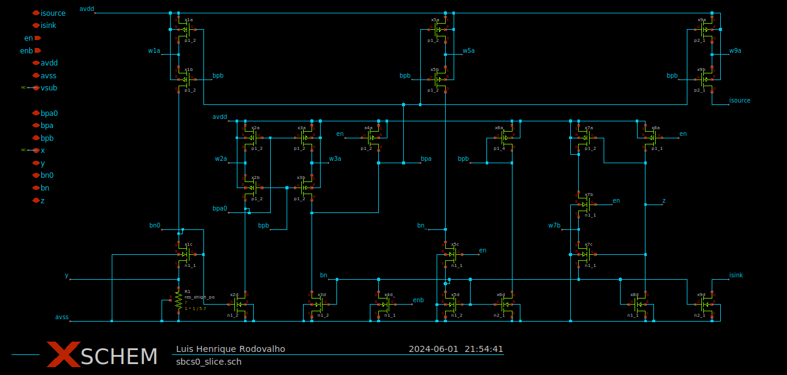
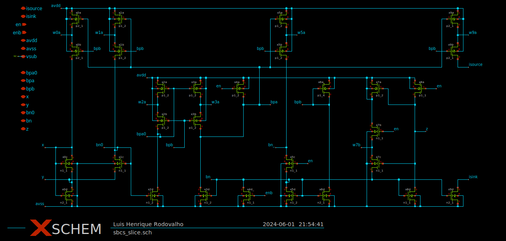
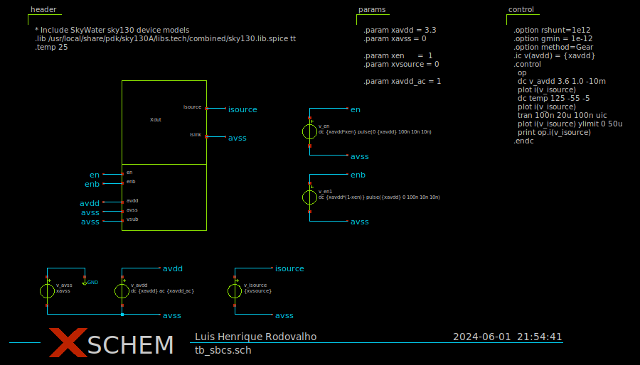
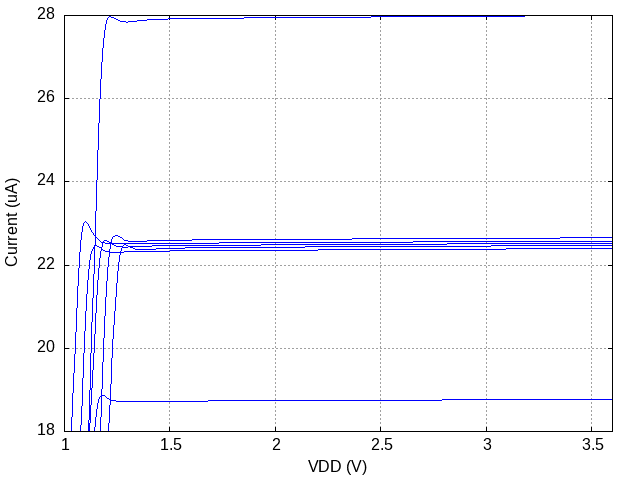
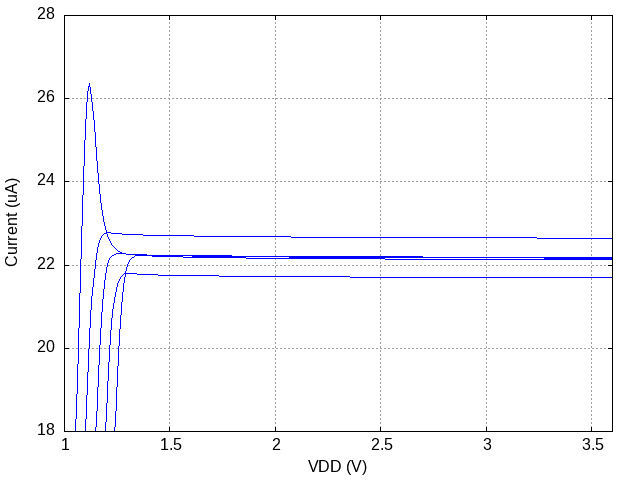
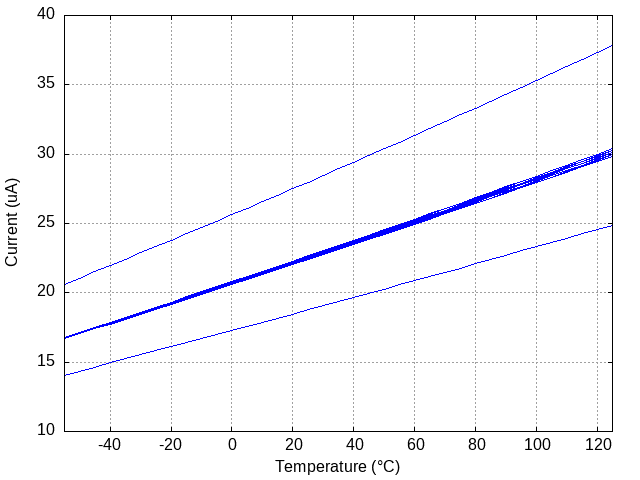
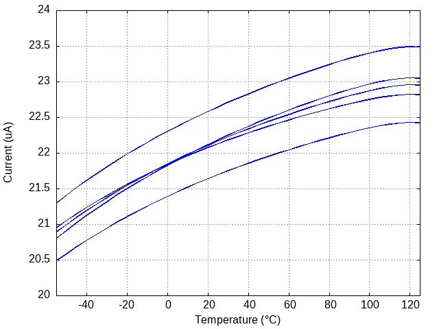
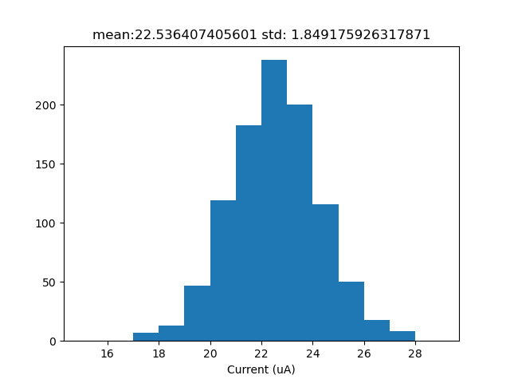
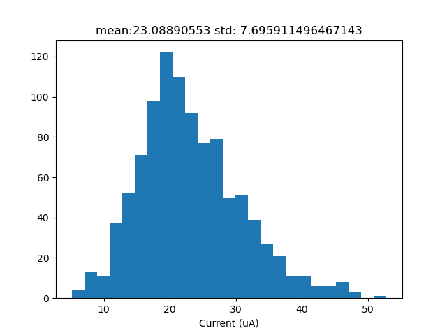

# Self-biased current source using SkyWater 130 nm open source PDK
This is a repository containing schematics for two versions of a self-biased current source made for comparison purposes. There is a conventional using resistors, and a CMOS only version based on [1]. They have the exact same structure and features, down to the same transistor dimensions, but the CMOS only has an extra circuit to bias and replace the resistor from the conventional. Both versions have in common transistor arrays, high-swing PMOS current mirrors, start-up circuit, and enable/disable switches.

# Schematics
## Conventional gm constant self-biased current source

## CMOS only gm constant self-biased current source

# Simulation results

## Testbench

**Process corners:** TT, HL, LH, SS, FF, SF, FS
**Temperature corners:** -40, 25, 125
**Voltage supply corners:** 3.0, 3.3, 3.6

## DC Sweep - Output current X Voltage Supply
| Conventional | CMOS Only |
| ------------ | --------- |
|  |  |

## DC Sweep - Output current X Temperature
**Temperature:** 25

| Conventional | CMOS Only |
| ------------ | --------- |
|  |  |

## Monte Carlo - Output current
**Number of runs:** 1000
**Temperature:** 25
**Type:** Local mismatch only

| Conventional | CMOS Only |
| ------------ | --------- |
|  |  |

# Conclusions
- CMOS only has a much less global process variation
- Conventional has much less local process variation
- Both are PTAT current references, but CMOS only has a lower coefficient temperature

# References
[1] Serra-Graells, Francisco, and Jose Luis Huertas. "Sub-1-V CMOS proportional-to-absolute temperature references." IEEE Journal of Solid-State Circuits 38.1 (2003): 84-88.
